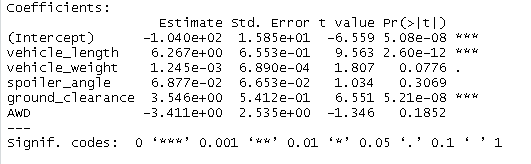

# MechaCarChallenge\

## Deliverable 1 and 2

In this analysis we ran linear regression and summary statistics to determine the correlation between multiple variables of car models and mpg. These variables included vehicle length, vehicle weight, and ground clearance. We then identified the consistency of suspension coils among manufacturing lots based on weight capacity.

Two datsets were used in the analysis. The first included 50 prototypes of cars (with the variables mentioned previously). 

Using this dataset, we determined that vehicle length, and ground clearance have the most signficant correlation with mpg (non-random), with p values much lower than 0.05. Spoiler angle, vehicle weight, and AWD did not present a significant correlation with mpg, with p-values much greater than 0.05.

The slope of this model is non-zero and has a multiple R-squared value of 0.7149. This indicates that the model has a capacity to explain mpg to an accuracy of 71.49% or 71.49% of the time. This is a relatively high level of accuracy and thus explains mpg relatively effectively.

## Delierable 3: Summary Statistics on Suspension Coils

The design specifications for the MechaCar suspension coils dictate that the variance of the suspension coils must not exceed 100 pounds per square inch. Lot 3 does not meet this minimum threshold, with a variance of 170.

The t-test value for Lot 1 was : 8.71 (high likelihood of repeatable results)
The t-test value for Lot 2 was : 3.67
The t-test value for Lot 3 was : -1.43 (lowest likelihood of repeatable results)

## Deliverable 4

As an additional analysis, I would like to calculate how MechaCar compares to it's competition in terms of the environmental impact of the materials in each car.

The null hypothesis is that there is no difference in environmental impact for the manufacturing of a MechaCar vs its competition.

In order to test this hypothesis, I would need data on the total mass of metals (and type of metal), the total plastics (and types of plastics), and total natural materials (leather, wood) within each car. Then, I would need baseline estimates on the CO2 impact of producing a kilogram of each material. I would need data on MechaCar's vehicles and it's competitors.

From there, I could calculate a total CO2 impact to produce each car. I could calculate the mean of all of the vehicles within each car manufacturer's arsenal, and determine the level of significance between the difference in the means. Additionally, I could identify the cars with the lowest 25% CO2 impact and compare those.